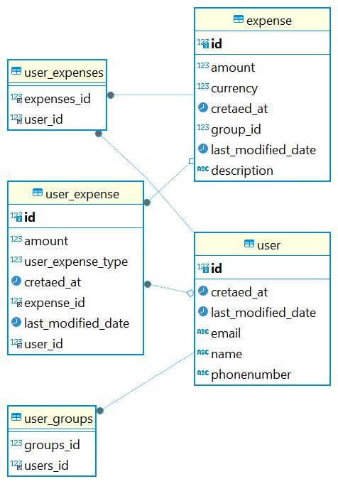

# Low Level Design - Splitwise

An expense sharing application is where you can add your expenses and split it among different people. The app keeps balances between people as in who owes how much to whom.

### Requirements & Setup

Requirements to run this program are :

- Java 17
- Maven
- MySQl Db

### Running the application locally

- Clone this repository
- In `resources/application.properties` replace the database credential
- spring.datasource.url = MYSQL_URL
    - e.g. jdbc:mysql://localhost:3306/splitwise
- spring.datasource.driver-class-name=com.mysql.cj.jdbc.Driver
- spring.datasource.username=DB_USERNAME
- spring.datasource.password=DB_PASSWORD

### Requirement

[Link](https://workat.tech/machine-coding/practice/splitwise-problem-0kp2yneec2q2)

- User: Each user should have a userId, name, email, mobile number.
- Expense: Could either be EQUAL, EXACT or PERCENT
- Users can add any amount, select any type of expense and split with any of the available users.
- The percent and amount provided could have decimals upto two decimal places.
- In case of percent, you need to verify if the total sum of percentage shares is 100 or not.
- In case of exact, you need to verify if the total sum of shares is equal to the total amount or not.
- The application should have a capability to show expenses for a single user as well as balances for everyone.
- When asked to show balances, the application should show balances of a user with all the users where there is a non-zero balance.
- The amount should b

### Input

- You can create a few users in your main method. No need to take it as input.
- There will be 3 types of input:
- Expense in the format: EXPENSE <user-id-of-person-who-paid> <no-of-users> <space-separated-list-of-users> <EQUAL/EXACT/PERCENT> <space-separated-values-in-case-of-non-equal>
- Show balances for all: SHOW
- Show balances for a single user: SHOW <user-id>

### Output

- When asked to show balance for a single user. Show all the balances that user is part of:
- Format: <user-id-of-x> owes <user-id-of-y>: <amount>
- If there are no balances for the input, print No balances
- In cases where the user for which balance was asked for, owes money, they’ll be x. They’ll be y otherwise.

### Class Diagram

### ER Diagram

### Settle Up Algo
1. Go through all the expenses and find the outstanding amount for each user
   1. Loop through each expense, and for each expense
   2. We will loop through all the userExpense
   3. If userExpense type is PAID, it will be added as +ve
   4. If userExpense type is HASTOPAY, it will be subtracted as -ve from each user
2. All the users with negative balance [hasToPay] => minHeap
3. All the users with positive balance [paid] => maxHeap
4. We will find the transactions

